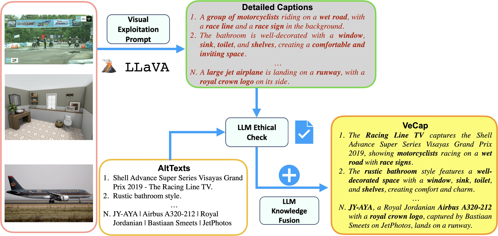

# [ECCV-2024] VeCLIP: Improving CLIP Training via Visual-enriched Captions

* A novel CLIP training scheme that achieves the SoTA performance on zero-shot ImageNet classification and COCO image text retreival using limited visual-enriched captions. * [[Paper](https://arxiv.org/abs/2310.07699)]

[Zhengfeng Lai*](https://zjujefflai.github.io/), [Haotian Zhang*](https://haotian-zhang.github.io/) , [Bowen Zhang](https://zbwglory.github.io/), Wentao Wu, Haoping Bai, Aleksei Timofeev, Xianzhi Du, [Zhe Gan](https://zhegan27.github.io/), Jiulong Shan, [Chen-Nee Chuah](https://www.ece.ucdavis.edu/~chuah/rubinet/people/chuah/bio.html), Yinfei Yang, Meng Cao [*: equal contribution]


<p align="center">
    </a> <br>
    Diagram of VeCap.
</p>

## Release
- [08/23/2024] 🔥 We release our VeCap-300M [dataset](#vecap-300m-download).
- [07/01/2024] 🔥 Our paper is accepted by ECCV 2024.
- [03/06/2024] 🔥 We released the VeCLIP & VeCap-DFN [checkpoints](#checkpoints).

## Contents
- [Install](#install)
- [Getting Started](#getting-started)
- [Checkpoints](#checkpoints)

## Install

1. Clone this repository
```Shell
git clone https://github.com/apple/ml-veclip
cd ml-veclip
```

2. Create an environment and install related packages
```Shell
conda create -n veclip python=3.9 -y
conda activate veclip
pip install -r requirements.txt
```

## Getting Started

See the [example notebook](https://github.com/apple/ml-veclip/blob/main/load_veclip.ipynb) for details on how to simply load the different checkpoints using HuggingFace transformers.

## VeCap-300M Download 
We split our 300M data into 10 jsons: for each image, we save the web link and our caption. 
```Shell
wget -i vecap300m.txt -b -c
```


## Checkpoints

We release the checkpoints for **VeCLIP**, which are trained from scratch on visual-enriched captions VeCap 3M/12M/100M/200M/300M, as reported in the paper. The models are evaluated on COCO/Flickr30k image-text retrieval and ImageNet/ImageNetv2 classification in a zero-shot fashion. Use `wget` or `curl` to download the below checkpoints. 

<table>
<thead>
  <tr>
    <th rowspan="2">Data</th>
    <th rowspan="2">Model</th>
    <th rowspan="2">Resolution</th>
    <th colspan="2">COCO (R@1)</th>
    <th colspan="2">Flickr30k (R@1)</th>
    <th rowspan="2">ImageNet</th>
    <th rowspan="2">ImageNetv2</th>
  </tr>
  <tr>
    <th>I2T</th>
    <th>T2I</th>
    <th>I2T</th>
    <th>T2I</th>
  </tr>
</thead>
<tbody>
  <tr>
    <td rowspan="2">VeCap 3M</td>
    <td>CLIP-B/16</td>
    <td>224x224</td>
    <td>5.46</td>
    <td>3.28</td>
    <td>12.20</td>
    <td>6.36</td>
    <td>5.46</td>
    <td>7.09</td>
  </tr>
  <tr>
    <td><a href="https://docs-assets.developer.apple.com/ml-research/models/veclip/veclip_b16_3m.zip">VeCLIP-B/16</a></td>
    <td>224x224</td>
    <td>22.30</td>
    <td>13.01</td>
    <td>40.60</td>
    <td>27.58</td>
    <td>15.98</td>
    <td>13.51</td>
  </tr>
  <tr>
    <td rowspan="2">VeCap 12M</td>
    <td>CLIP-B/16</td>
    <td>224x224</td>
    <td>24.52</td>
    <td>14.28</td>
    <td>44.70</td>
    <td>290.6</td>
    <td>31.60</td>
    <td>27.03</td>
  </tr>
  <tr>
    <td><a href="https://docs-assets.developer.apple.com/ml-research/models/veclip/veclip_b16_12m.zip">VeCLIP-B/16</a></td>
    <td>224x224</td>
    <td>47.78</td>
    <td>31.62</td>
    <td>73.90</td>
    <td>55.68</td>
    <td>38.11</td>
    <td>32.53</td>
  </tr>
  <tr>
    <td rowspan="2">VeCap 100M</td>
    <td>CLIP-B/16</td>
    <td>224x224</td>
    <td>47.24</td>
    <td>30.61</td>
    <td>74.40</td>
    <td>57.16</td>
    <td>58.64</td>
    <td>50.96</td>
  </tr>
  <tr>
    <td><a href="https://docs-assets.developer.apple.com/ml-research/models/veclip/veclip_b16_100m.zip">VeCLIP-B/16</a></td>
    <td>224x224</td>
    <td>64.82</td>
    <td>46.12</td>
    <td>89.30</td>
    <td>73.10</td>
    <td>60.77</td>
    <td>54.17</td>
  </tr>
  <tr>
    <td rowspan="2">VeCap 200M</td>
    <td>CLIP-B/16</td>
    <td>224x224</td>
    <td>52.20</td>
    <td>34.97</td>
    <td>80.90</td>
    <td>63.26</td>
    <td>63.72</td>
    <td>56.84</td>
  </tr>
  <tr>
    <td><a href="https://docs-assets.developer.apple.com/ml-research/models/veclip/veclip_b16_200m.zip">VeCLIP-B/16</a></td>
    <td>224x224</td>
    <td>67.20</td>
    <td>48.40</td>
    <td>91.10</td>
    <td>76.32</td>
    <td>64.64</td>
    <td>57.67</td>
  </tr>
</tbody>
</table>


We further found our VeCap can also be complementary to other well-established filtering methods, e.g., [Data Filtering Network (DFN)](ttps://arxiv.org/abs/2309.17425). We also provide thosse checkpoints (referred to as **VeCap-DFN**) and report their performance below. 

<table>
<thead>
<tr>
<th rowspan="2">Backbone</th>
<th rowspan="2">Resolution</th>
<th rowspan="2">Data</th>
<th colspan="2">COCO (R@1)</th>
<th colspan="2">Flickr30k (R@1)</th>
<th rowspan="2">ImageNet</th>
<th rowspan="2">ImageNetV2</th>
</tr>
<tr>
<th>I2T</th>
<th>T2I</th>
<th>I2T</th>
<th>T2I</th>

</tr>
</thead>
<tbody>
<tr>
<td rowspan="3"><a href="https://docs-assets.developer.apple.com/ml-research/models/veclip/vecapdfn_clip_b16.zip">VeCap-DFN-B/16</a></td>
<td rowspan="3">224x224</td>
<td>DFN </td>
<td>62.96</td>
<td>43.20</td>
<td>87.10</td>
<td>70.44</td>
<td>76.15</td>
<td>68.19</td>
</tr>
<tr>
<td>VeCap 300M</td>
<td>64.74</td>
<td>44.58</td>
<td>90.10</td>
<td>73.14</td>
<td>46.43</td>
<td>41.15</td>
</tr>
<tr>
<td>DFN + VeCap 300M</td>
<td>66.28</td>
<td>45.12</td>
<td>88.80</td>
<td>73.56</td>
<td>76.19</td>
<td>69.58</td>
</tr>
<tr>
<td rowspan="1"><a href="https://docs-assets.developer.apple.com/ml-research/models/veclip/vecapdfn_clip_l14.zip">VeCap-DFN-L/14</a></td>
<td rowspan="1">224x224</td>
<td>DFN + VeCap 300M</td>
<td>71.06</td>
<td>51.13</td>
<td>93.10</td>
<td>80.96</td>
<td>81.95</td>
<td>75.48</td>
</tr>
<tr>
<td rowspan="2"><a href="https://docs-assets.developer.apple.com/ml-research/models/veclip/vecapdfn_clip_h14_336.zip">VeCap-DFN-H/14</a></td>
<td rowspan="1">336x336</td>
<td>DFN + VeCap 300M</td>
<td>72.78</td>
<td>52.33</td>
<td>93.60</td>
<td>82.64</td>
<td>83.07</td>
<td>76.37</td>
</tr>
</tbody>
</table>


## Citation

If you find VeCLIP useful, please cite using this BibTeX:

```bibtex
@misc{lai2024veclip,
      title={VeCLIP: Improving CLIP Training via Visual-enriched Captions}, 
      author={Zhengfeng Lai and Haotian Zhang and Bowen Zhang and Wentao Wu and Haoping Bai and Aleksei Timofeev and Xianzhi Du and Zhe Gan and Jiulong Shan and Chen-Nee Chuah and Yinfei Yang and Meng Cao},
      year={2024},
      eprint={2310.07699},
      archivePrefix={arXiv},
      primaryClass={cs.CV}
}
@article{fang2023data,
  title={Data filtering networks},
  author={Fang, Alex and Jose, Albin Madappally and Jain, Amit and Schmidt, Ludwig and Toshev, Alexander and Shankar, Vaishaal},
  journal={arXiv preprint arXiv:2309.17425},
  year={2023}
}
```

## Acknowledgement

- [axlearn](https://github.com/apple/axlearn): the codebase we use to train the models. 
- [huggingface transformers](https://huggingface.co/docs/transformers/en/index): Transformers provides APIs to load our trained models.
